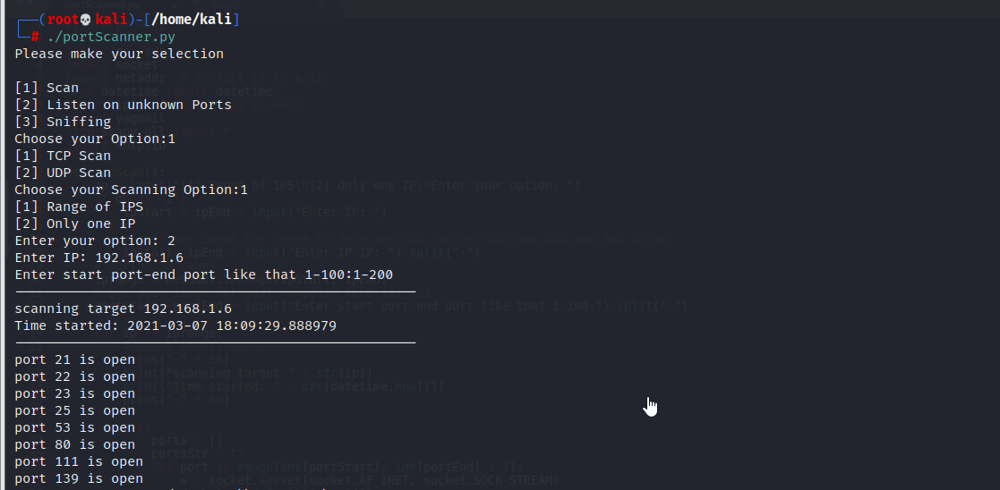
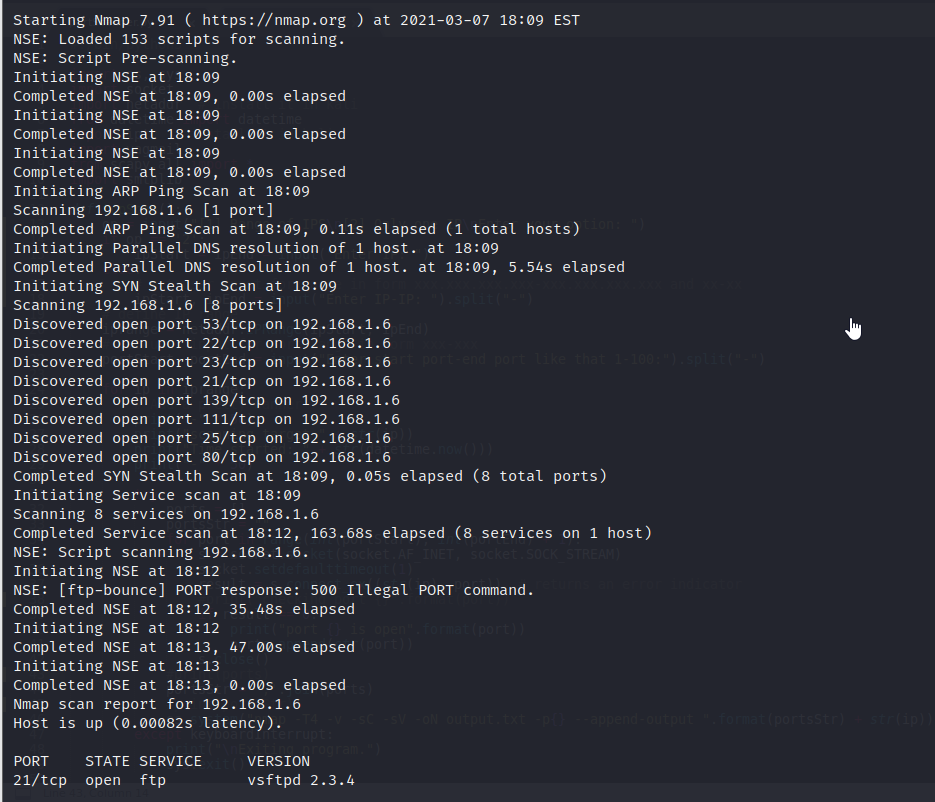
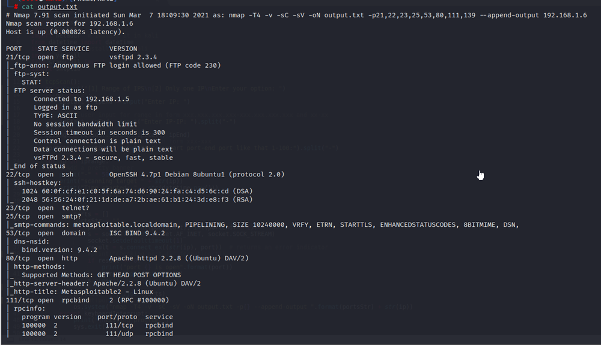

# Port Scanner using python on kali linux

## It has multible features:

1) It will scan a range of IPs [TCP & UDP] using sockets. after
gaining the open ports, pass them to Nmap with -sC -sV options,
parse the output and save it to the file after displaying it to
the user.

Running test cases on Metasploitabl2 so this test case on one IP not range of IPs

TCP Scan:

Nmap:

output file of nmap:

***

2) listen to unknown ports and check if someone is trying to
connect], send a mail and block the IP [Block using iptc module
from iptables].

3) Sniff the incoming traffic, and check the source IP, it doesn't
match the interface subnet that is sniffing the traffic, an alert
is generated.